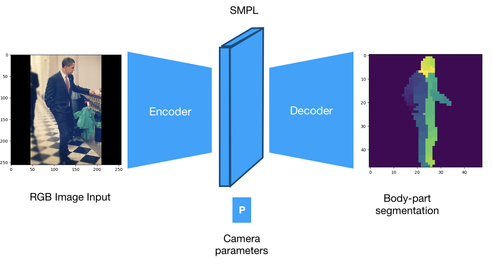

# Human 3D pose and shape estimation via indirect learning.

An encoder-decoder model to solve 3D human pose and shape estimation WITHOUT requiring any 3D labelled data (i.e. without 3D joint labels/3D keypoint labels). The model outputs 31-body-part segmentations and obtains the desired 3D vertex mesh as an intermiedate step at the bottleneck of the auto-encoder.

The SMPL body model (http://smpl.is.tue.mpg.de) is used to parametrise 3D human pose and shape. The SMPL rendering function is implemented in tensorflow+keras - the implementation is heavily influenced by https://akanazawa.github.io/hmr/. 

## Example results

Please give the above gif a few seconds to load!

Clockwise: Input image, (ground truth segmentation - for still images above), 3D body model rendering, 31 Body-part segmentation (network output), Locations of (projected) predicted vertices relative to input image.

## Requirements

python 2.7

keras >= 2.1.0

tensorflow >= 1.6

opendr

## Usage

predict.py can be used to make new predictions from RGB image inputs. Simply change the filepath in the predict function call at the bottom of the script to a file path for a directory containing input images. Unzip the provided weights file (in full_network_weights) and change the weights file name argument in the predict function call to the correct name. Then, simply run
    python predict.py

