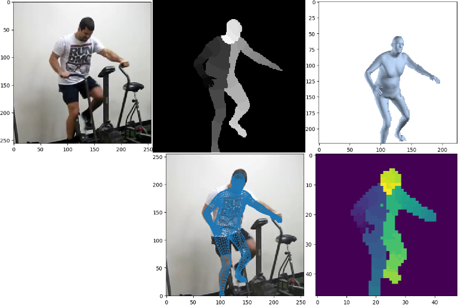
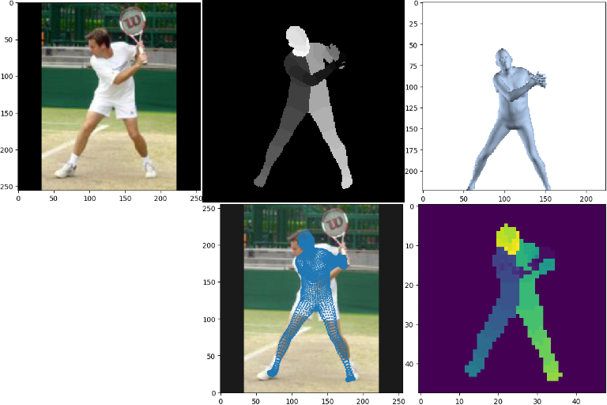

# Human 3D pose and shape estimation via indirect learning.

An encoder-decoder model to solve 3D human pose and shape estimation WITHOUT requiring any 3D labelled data (i.e. without 3D joint labels/3D keypoint labels). The model outputs 31-body-part segmentations and obtains the desired 3D vertex mesh as an intermiedate step at the bottleneck of the auto-encoder.

## Requirements

python 2.7
keras >= 2.1.0
tensorflow >= 1.6
opendr
